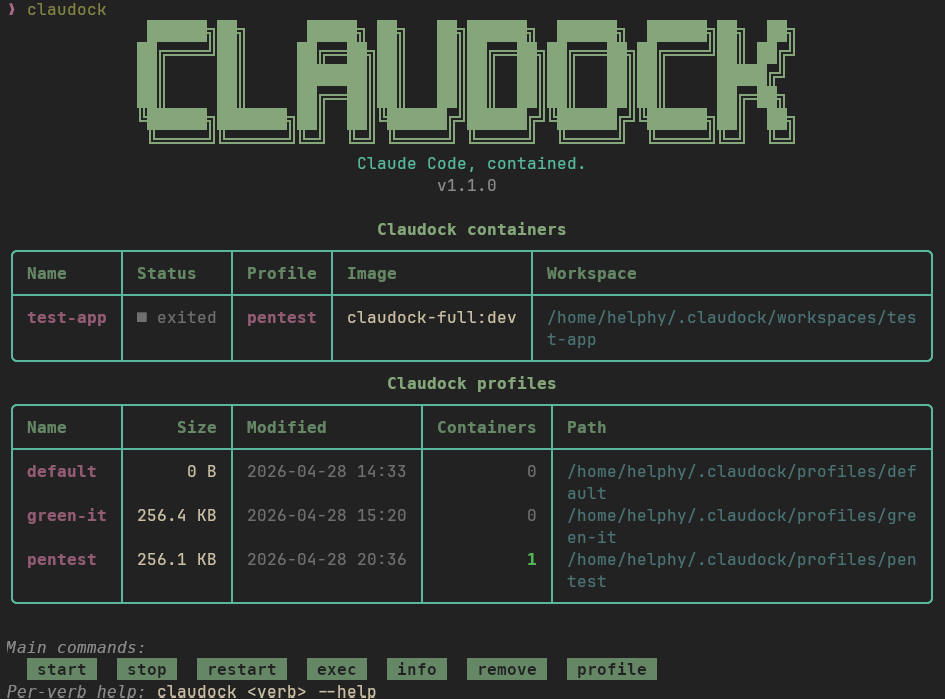

<div align="center">



**A secure, containerized wrapper for Claude Code**

[](https://www.python.org)
[](LICENSE)
[](https://github.com/Helphyy/claudock/releases)
[](https://www.docker.com)
[](https://pipx.pypa.io)

[Installation](#installation) · [Quick Start](#quick-start) · [Commands](docs/commands.md) · [Images](docs/images.md) · [Profiles](docs/profiles.md)

</div>

---

## Features

- 📦 **Named, persistent containers** , one per project, state survives across sessions (shell history, ad-hoc installs, Claude conversations)
- 🔐 **Multi-profile Claude auth** , isolate `personal` / `work` / `client` OAuth logins, switch with `--profile`
- 🖼 **Seven layered images** , `minimal`, `dev`, `cloud`, `security`, `data`, `doc`, `full` (all ship Claude Code, code-server, zsh, asciinema, headed browsers)
- 🛡 **Sandboxed by default** , no Docker socket, no `--privileged`, `no-new-privileges`, default Docker capabilities only
- 🌐 **VSCode in browser** , code-server with the official `Anthropic.claude-code` extension, exposed on `127.0.0.1:8080`
- 🎬 **Session recording** , optional asciinema capture for audit and replay
- 🖥 **X11 forwarding** , run headed Chromium / Firefox / Playwright inside the container on your host display
- ⚙️ **Project config** , `.claudock.yml` bakes in defaults so `claudock start` stays short
- ⚡ **Claude flag pass-through** , `--model`, `--continue`, `--resume`, `--print`, `--permission-mode`, `--add-dir`, `--ide`

---

## Installation

Requires **Python 3.11+**, **Docker 24+**, and [pipx](https://pipx.pypa.io/).

```bash
pipx install git+https://github.com/Helphyy/claudock.git
```

To upgrade:

```bash
pipx upgrade claudock
```

See [docs/installation.md](docs/installation.md) for alternative install methods (clone + editable, dev deps).

---

## Quick Start

**1.** Pull at least one image:

```bash
claudock image install dev    # or: minimal, cloud, security, data, doc, full
```

**2.** Create a Claude auth profile:

```bash
claudock profile create personal
```

**3.** Start a container on a project:

```bash
cd ~/code/my-project
claudock start my-project --cwd
```

This creates `claudock-my-project`, mounts the cwd at `/workspace`, mounts the profile's `.claude/` at `/root/.claude`, and drops you into a zsh shell.

**4.** Run Claude inside the container:

```bash
claude
```

The first run opens the OAuth flow in your browser; tokens are persisted to the host profile.

> Re-attach later with the same `claudock start my-project` command, all your state is preserved.

---

## Command Groups

| Group | Description |
|:------|:------------|
| `claudock` | Dashboard (banner, container table, profile table, cheatsheet) |
| `claudock start` | Create / start / attach a named container, with 25+ flags |
| `claudock stop` / `restart` / `remove` | Container lifecycle, with interactive selectors |
| `claudock exec` | Run a one-off command inside a container |
| `claudock info` | Tabular view of every Claudock container |
| `claudock logs` | List asciinema recordings of a container |
| `claudock image` | Image management (list, install, install-all, update, remove, build) |
| `claudock profile` | Claude auth profile management (list, create, show, remove) |
| `claudock config` | Resolved config viewer / path / editor |
| `claudock version` | Print the CLI version |

→ **[Full command reference](docs/commands.md)** · **[Start flags](docs/flags.md)**

---

## Examples

```bash
# Persistent container named "monrepo" on the current cwd
claudock start monrepo --cwd

# Disposable container with an API key and one exposed port
claudock start review --tmp -e ANTHROPIC_API_KEY=sk-... -p 3000:3000

# Shared pnpm cache + SYS_PTRACE for gdb/strace
claudock start backend --cwd -V ~/.cache/pnpm:/root/.cache/pnpm --cap SYS_PTRACE

# Host networking to debug a local service
claudock start hostnet --cwd --network host

# Separate perso / pro profiles
claudock start side-project --cwd --profile perso
claudock start app-client    --cwd --profile pro

# Record the session for audit / replay
claudock start audit --cwd --log
asciinema play ~/.claudock/logs/audit/<timestamp>.cast

# Clone a repo + forward the host ssh-agent on creation
claudock start my-fork --git git@github.com:user/repo.git

# VSCode in the browser (code-server + Claude Code extension)
claudock start my-project --cwd --vscode

# Headed Chromium / Firefox via X11
xhost +local:
claudock start gui --cwd --x11

# Resume the last Claude conversation, pin the model
claudock start my-app --cwd -c --model claude-opus-4-7

# YOLO mode (alias of --dangerously-skip-permissions) + custom effort
claudock start my-app --cwd --yolo --effort high

# Non-interactive run (CI / scripts)
claudock start audit --cwd --permission-mode plan \
  --add-dir /etc/configs --print "Audit /workspace and report"
```

---

## Project Config

Drop a `.claudock.yml` at the root of your workdir to bake in defaults:

```yaml
defaults:
  image: claudock-dev:latest
  profile: pro
  network: bridge
  shell: zsh
  vscode: false
  log: false
  ssh: true
  caps: [SYS_PTRACE]
  env:
    HTTP_PROXY: http://proxy:3128
  volumes:
    - /shared:/cache:ro
  ports:
    - "3000:3000"
```

Resolution order: **CLI flag > `.claudock.yml` > `~/.claudock/config.yml` > built-in**.

→ **[Full project-config reference](docs/project-config.md)**

---

## Shell Completion

```bash
claudock --install-completion bash && source ~/.bashrc   # Bash
claudock --install-completion zsh  && source ~/.zshrc    # Zsh
claudock --install-completion fish                        # Fish
```

Auto-detect from `$SHELL`:

```bash
claudock --install-completion
```

Print the completion script without installing it (pipe it wherever you want):

```bash
claudock --show-completion bash > /etc/bash_completion.d/claudock
```

Powered by [argcomplete](https://kislyuk.github.io/argcomplete/), so every verb, sub-action and flag (including the long `start` flag list) is completed.

---

## Security

- Default Docker capabilities only, `no-new-privileges`, no `--privileged`
- Docker socket **never** mounted by default (`--docker` opts in, with a warning panel because it grants effective root on the host)
- Profiles stored under `~/.claudock/profiles/<name>/` with `0700` permissions
- `/workspace` ownership rewritten to your host group with setgid + `umask 002`, so files created by container root are still rw for your host user, no `sudo` round-trips
- `--x11` forwards your real X server, only enable on code you trust

→ **[Filesystem](docs/filesystem.md)** · **[Networking](docs/networking.md)**

---

## Development

```bash
git clone https://github.com/Helphyy/claudock.git
cd claudock
python3 -m venv .venv && source .venv/bin/activate
pip install -e '.[dev]'
```

```bash
ruff format .         # Format
ruff check .          # Lint
mypy src/claudock     # Type check
pytest                # Test
```

---

## Acknowledgements

Heavily inspired by [Exegol](https://github.com/ThePorgs/Exegol), the containerized offensive-security environment. Claudock borrows its core ideas (named persistent containers, profile-based credential mounts, image-management CLI) and adapts them to running Claude Code safely on any project.

---

## License

GPLv3, see [LICENSE](LICENSE).
